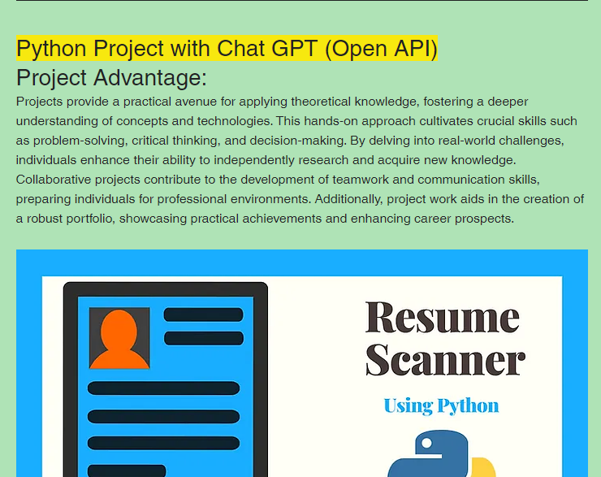
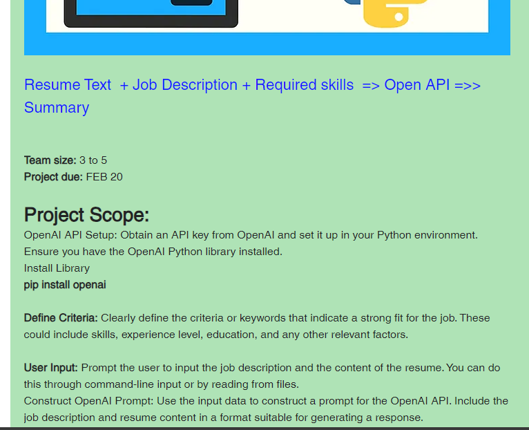
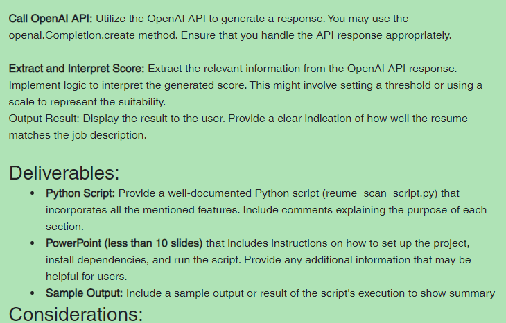
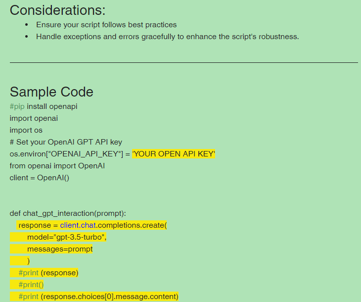

# AI-Powered Candidate Resume Scoring Assistant (GPT-3.5 & Tkinter Desktop Application)

## Overview

Human Resources departments and recruitment teams face substantial bottlenecks when manually screening hundreds of candidate resumes against specialized job requirements. Automated screening tools frequently rely on rigid keyword matching, missing qualified candidates who express skills using alternative phrasing.

This project implements an intelligent, desktop-based recruitment assistant combining a multi-format document parser (PDF, DOCX, TXT), an interactive Tkinter graphical interface, and OpenAI's GPT-3.5-Turbo language model. The application evaluates candidate CVs against target job descriptions and mandatory technical competencies, providing quantitative match scoring and qualitative hiring feedback.

---


---

## Problem Statement

Human Resources recruitment teams receive hundreds of candidate resumes for technical roles, making manual CV screening a severe operational bottleneck. Traditional automated Applicant Tracking Systems (ATS) rely on brittle keyword matching that penalizes qualified applicants who use synonym phrasing. Recruitment departments require an intelligent desktop screening assistant powered by large language models that dynamically evaluates candidate resumes (PDF, DOCX, TXT) against job descriptions and mandatory prerequisites with semantic reasoning.

## System Architecture and Workflow

```
[ Candidate Resume (PDF / DOCX / TXT) ] + [ Job Description & Mandatory Competencies ]
 |
 v
[ Document Text Ingestion & Normalization Layer (PyPDF2 / python-docx) ]
 |
 v
[ Structured Prompt Engineering & Context Assembly ]
 |
 v
[ OpenAI GPT-3.5-Turbo API Language Reasoning Engine ]
 |
 v
[ Quantitative Score Extraction & Qualitative Gap Feedback ]
 |
 v
[ Interactive Tkinter Desktop Display & Dialog System ]
```

---

## Key Features

- **Multi-Format Document Parsing**: Native extraction of structured text from Adobe PDF (`PyPDF2`), Microsoft Word (`python-docx`), and raw text files (`.txt`).
- **Context-Aware Semantic Matching**: Leverages large language model reasoning to evaluate relevant experience, domain expertise, and role fit beyond simple regex keyword checks.
- **Mandatory Skill Verification**: Enforces explicit compliance scoring against client-specified mandatory technical prerequisites.
- **Quantitative & Qualitative Output**: Computes an objective alignment score alongside constructive analytical explanations of candidate strengths and missing proficiencies.
- **Desktop Graphical Interface**: Clean Tkinter desktop layout with file picker dialogs, scrollable text areas, and instant scoring buttons.

---

## Application Walkthrough & User Interface

### 1. Application Launch and Document Ingestion


*Interpretation*: The primary desktop interface displays dedicated panels for Resume content, Target Job Description, and Mandatory Competency tags.

### 2. Resume Loading and Automated Text Extraction


*Interpretation*: Selecting a candidate PDF or DOCX file triggers automated text extraction, populating the left-hand text buffer.

### 3. Job Description Specification & Keyword Tagging


*Interpretation*: The recruiter inputs the required role responsibilities and comma-separated mandatory technical keywords.

### 4. AI-Driven Evaluation and Match Scoring


*Interpretation*: Triggering the evaluation engine submits the contextual prompt to the OpenAI API, returning the quantitative alignment score and qualitative fit summary.

---

## Technical Specifications

| Component | Technology / Library |
| :--- | :--- |
| **Programming Language** | Python 3.8+ |
| **GUI Framework** | Python Tkinter |
| **LLM Inference Engine** | OpenAI API (`gpt-3.5-turbo`) |
| **Document Parsers** | `PyPDF2` (PDFs), `python-docx` (Word Documents) |
| **Input Supported** | `.pdf`, `.docx`, `.doc`, `.txt` |

---

## Project Structure

```
resume-scoring-assistant-llm/
├── final/
│ ├── project.py # Main Tkinter application and OpenAI API pipeline
│ ├── resume.txt # Sample candidate resume data
│ └── job desc.txt # Sample benchmark job description
├── 1.png - 10.png # Graphical workflow interface screenshots
├── requirements.txt # Runtime dependencies
└── README.md # Technical documentation
```

---

## Installation and Environment Setup

### 1. Clone Repository
```bash
git clone https://github.com/AbdulRehmanRattu/Resume-Scoring-Assistant-GPT3.5.git
cd Resume-Scoring-Assistant-GPT3.5
```

### 2. Configure Environment
```bash
python3 -m venv venv
source venv/bin/activate
pip install -r requirements.txt
```

### 3. Requirements Specification (`requirements.txt`)
```
openai>=0.28.0,<1.0.0
PyPDF2>=3.0.0
python-docx>=0.8.11
```

### 4. Set OpenAI API Key
Configure your OpenAI API key as an environment variable or directly within the configuration:
```bash
export OPENAI_API_KEY="your-api-key-here"
```

---

## Usage Guide

Launch the desktop application:
```bash
python final/project.py
```

### Operational Steps:
1. Click **Upload Resume** to select a candidate resume file (`.pdf`, `.docx`, or `.txt`).
2. Paste the target position requirements into the **Job Description** box.
3. Specify any mandatory core competencies in the **Mandatory Keywords** field.
4. Click **Calculate Score** to generate the candidate alignment assessment.
